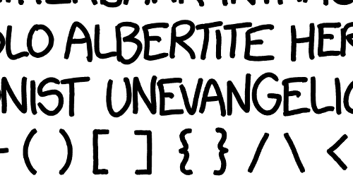

Title: Playing with Randall Munroe's XKCD handwriting
Date: 2017-03-16
Category: field-notes
Tags: XKCD, fonts, Python
Slug: xkcd_font
Author: Phil Elson

The XKCD font (as used by matplotlib et al.) recently [got an update](https://github.com/ipython/xkcd-font/pull/13) to include lower-case characters.
For some time now I have been aware of a handwriting sample produced by Randall Munroe (XKCD's creator) that I was interested in exploring.
The ultimate aim is to automatically produce a font-file using open source tools, and to learn a few things along the way.

<!-- PELICAN_END_SUMMARY -->

The thing about fonts is that there is actually a lot going on:

 * **spacing** - the whitespace around a character
 * **kering** - special case whitespace adjustments (e.g. notice the space between "Aw" is much closer than between "As")
 * **hinting** - techniques for improved rasterization at low resolution
 * **liatures** - special pairs/groups of characters. The traditional example is ffi, but for hand-writing, any character combination is plausible.

The raw material I'm going to use is a scan produced by XKCD author Randall Munroe containing many charaters, as well as some spacing and ligature information.
Importantly, all of the glyphs have been written at the same scale and using the same pen.
These two details are important, as they will allow us to derive appropriate spacing and kerning information, and should result in a font that is well balanced.

(full image available on GitHub at [https://github.com/ipython/xkcd-font/issues/9#issuecomment-127412261](https://github.com/ipython/xkcd-font/issues/9#issuecomment-127412261))

Notice some interesting features of this sample, including ligatures (notice that "LB" is a single mark) and
kerning (see the spacing of "VA"):

There are a few useful articles already out there on this topic, particularly one from 2010 regarding the creation of fonts from a [hand-written sample](http://scruss.com/blog/2010/05/09/creating-a-truetype-font-from-your-handwriting-with-your-scanner-your-printer-and-fontforge/).
Notably though, there isn't much that is automated - this is a rub for me, as without automation it is challenging for others to contribute to the font in an open and diffable way.

Let's get stuck in by separating each of the glyphs from the image into their own image.



## Conclusion

In this initial phase, we haven't done anything particularly clever - we've simply loaded in the image,
taken a subset, and used scipy's image labelling capabilities to understand what the labelling process looks like.
Originally I had planned to try to separate some of the glyphs that were obviously fused together - I'd even gone as far
as protyping using a filter to disolve the outline (so that I could separate the labels) and then subsequently growing the
labels again back to their original form (but keeping the separate labels). This technique worked, but it produced shapes that
weren't perfect, and the complexities (e.g. handling of bits that dissapeared, such as dots on the letter "i") weren't worth it.

In the next phase, we will use the techinque shown here to generate individual image files. In addition, we will apply some heuristics
merge back together glyphs such as the dot and comma of a semi-colon.

*The next article in this series is*: **[Segment, extract, and combine features of an image with SciPy and scikit-image](./xkcd_font_pt2.md)**. 

Follow up items (some not yet written):

 * Blending together obvious glyphs
 * Converting to vector
 * Generating the font with font-forge
